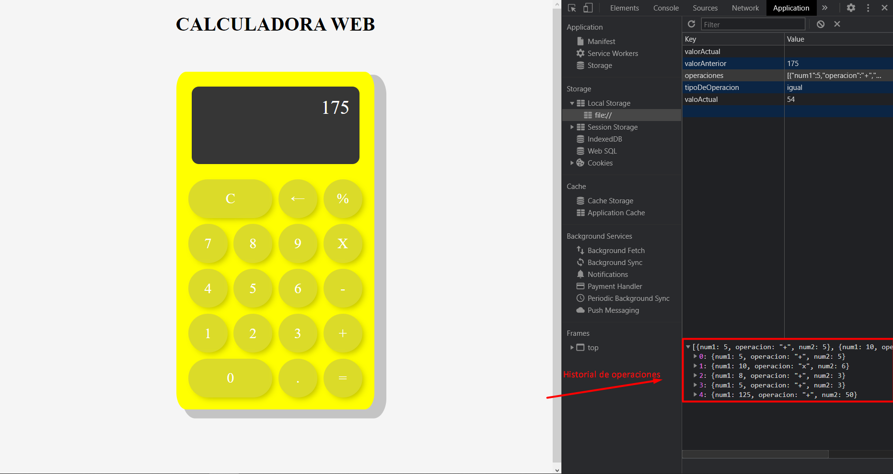

# Calculadora JS

En esta tarea podemos ver como se registra el historial de operaciones aritmeticas que creamos

En caso de querer eliminar estas podemos escribir en la consola del buscador: " display.calculador.historial.borrarHistorial() "

Por un pequeño percance de tiempo no pude mostrar este proceso visualmente para que el usuario pudiera interactuar con el.
